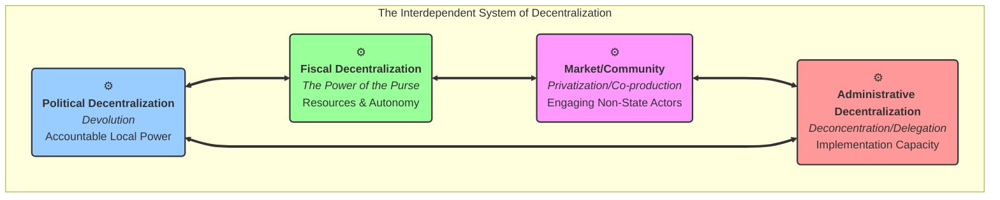

```mermaid
graph TD
    subgraph "The Interdependent System of Decentralization"
        direction LR
        P("⚙️<br><b>Political Decentralization</b><br><i>Devolution</i><br>Accountable Local Power")
        F("⚙️<br><b>Fiscal Decentralization</b><br><i>The Power of the Purse</i><br>Resources & Autonomy")
        A("⚙️<br><b>Administrative Decentralization</b><br><i>Deconcentration/Delegation</i><br>Implementation Capacity")
        M("⚙️<br><b>Market/Community</b><br><i>Privatization/Co-production</i><br>Engaging Non-State Actors")

        P <===> F
        A <===> P
        F <===> M
        M <===> A
    end

    style P fill:#9cf,stroke:#333,stroke-width:2px
    style F fill:#9f9,stroke:#333,stroke-width:2px
    style A fill:#f99,stroke:#333,stroke-width:2px
    style M fill:#f9f,stroke:#333,stroke-width:2px
```
